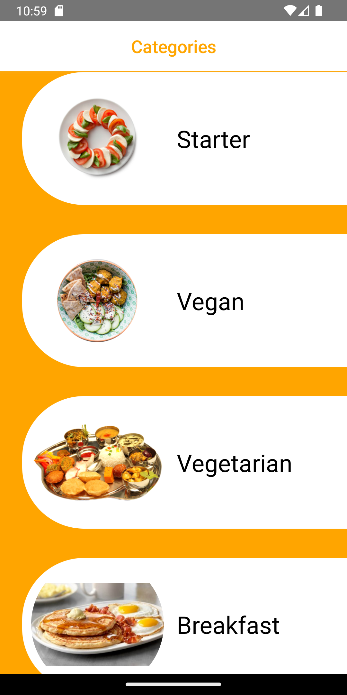

# Tarifka
 Patika Projects-3

I had been working on this project for a while. I encountered many problems during the fetching processes. Then I realized that the biggest problem was the data type. When I returned the data type php to JSON, all problems were solved. 
I learned so many components with this project such fetching data and navigation. Also, I practiced design and CSS skills.

When you open the app, you will see the categories page first. There are a lot of categories you can choose. 

If you click on a category, you will see all the dishes in it.

Then choose a dish, you will find the recipe and " Watch On Youtube " button on the detail page. The "Watch On Youtube" button is working, it sends you a YouTube video, but the " Add Favs " button not working. I have to work on it a little bit more.

